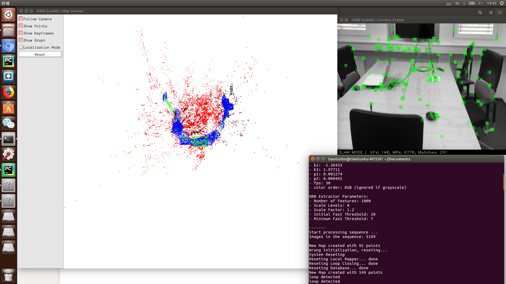

# My-ORB-SLAM
ORB_SLAM is a widely used visual SLAM algorithm, whch could solve online or offline SLAM Problems, 
'ORB' stands for 'Oriented FAST and rotated BRIEF', more details and origin repository could be found in:

link: https://github.com/raulmur/ORB_SLAM2.git

This repository is built to save and analysis the data from Monucular ORB_SLAM for 3D environment reconstruction, motion recovery and frame correction.
After the running of ORB_SLAM, these data would be downloaded in several .TXT files. 

## Save data from ORB_SLAM:
I did some changes in source code to read and save the motion data like 3D position of Keyframes and Map-Points, Quaternion also 4*4 Camera Matrix for every frame to reover the orientations.

### KeyFrameTrajectory.txt :
this file saves the motion data of every keyframe in sequence, the meaning of components in each line is:\
[TimeStamp, Coord.x, Coord.y, Coord.Z, Quater.x, Quater.y, Quater.z, Quater.w, [4*4 Camera Matrix]]

### KeyPoints.txt :
this file saves the 2D coordinates of the key points on every KeyFrames found with FAST operator :\
[TimeStamp, [2D KeyPoint1], [2D KeyPoint2], ...... ]

### MapPointsinKeyFrames.txt :
this file save the corresponding 3D MapPoint of each key points on each KeyFrame :\
[TimeStamp, [3D MapPonit1], [3D KeyPoint2], ...... ]

A sparse 3D Map and motion trajectory could be recovered from the saved data, however, ORB_SLAM itself can't determine this real scale and real orientation of the trajectory. More advanced algoriothm should be used in this case.
